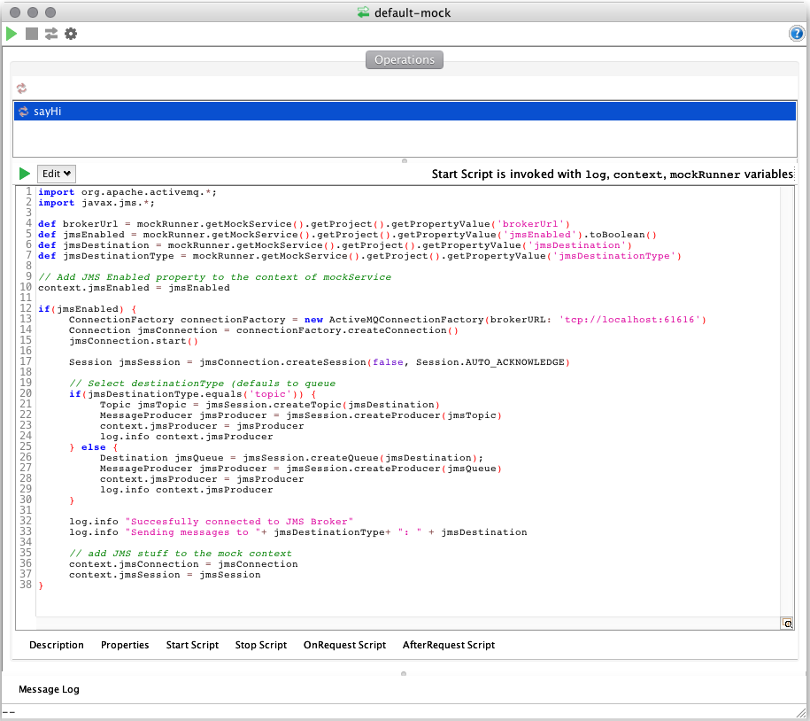
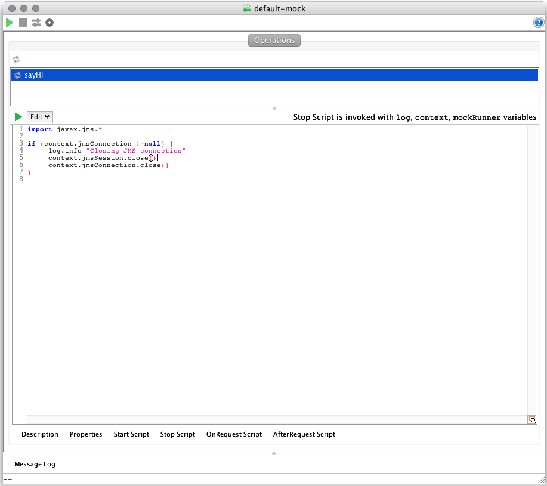
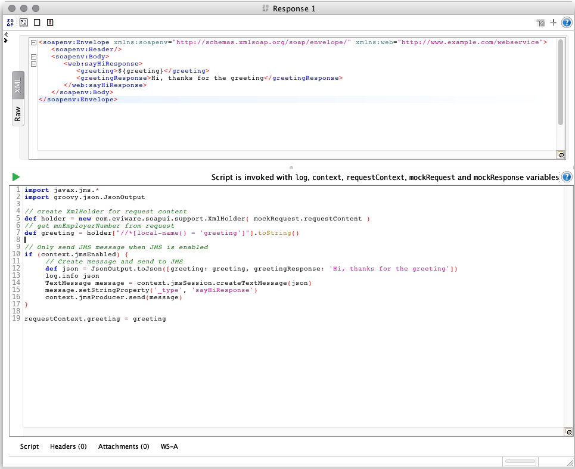

# Using JMS in Soap-UI

Sometimes it's handy to be able to send or receive message from a message broker when mocking SOAP/REST service with SOAP-UI.

This document is a short tutorial/example on how to do this and mainly focusses on sending messages to a JMS server when a Mocked SOAP message is received.

## Sending JMS messages from a SOAP-UI mock.

A SOAP-UI mock service has several 'hooks' where scripts can be executed to do 'extra stuff'. These can be for example when the mock service starts/stops, received a request, after a request has been processed etc. This feature allows us to connect to another server, like a database server or message broker, and allows the mock service to be more dynamic.

### Set up the connection to the ActiveMQ broker

First set up the following four custom properties on your SOAP-UI **project** (so **not** the mock service properties):

property           | value                 | remarks
-------------------|-----------------------|-----------------------------
brokerUrl          | tcp://localhost:61616 | if using an external ActiveMQ, than use the proper url
jmsEnabled         | true                  | set to false to disable sending JMS messages
jmsDestination     | Mock.Q                | i.e. the name of the topic or queue to send the messages to
jmsDestinationType | queue                 | use queue or topic, defaults to queue

Open the MockService Editor of your mock service. To connect to the ActiveMQ broker (running in the same container as your mock service), add the following groovy script to the 'Start Script' of the mock service.

``` groovy
import org.apache.activemq.*;
import javax.jms.*;

def brokerUrl = mockRunner.getMockService().getProject().getPropertyValue(brokerUrl)
def jmsEnabled = mockRunner.getMockService().getProject().getPropertyValue('jmsEnabled').toBoolean()
def jmsDestination = mockRunner.getMockService().getProject().getPropertyValue('jmsDestination')
def jmsDestinationType = mockRunner.getMockService().getProject().getPropertyValue('jmsDestinationType')

// Add JMS Enabled property to the context of mockService
context.jmsEnabled = jmsEnabled

if(jmsEnabled) {
	ConnectionFactory connectionFactory = new ActiveMQConnectionFactory(brokerURL: brokerUrl)
	Connection jmsConnection = connectionFactory.createConnection()
	jmsConnection.start()
	
	Session jmsSession = jmsConnection.createSession(false, Session.AUTO_ACKNOWLEDGE)

	// Select destinationType (defauls to queue
	if(jmsDestinationType.equals('topic')) {
		Topic jmsTopic = jmsSession.createTopic(jmsDestination) 
		MessageProducer jmsProducer = jmsSession.createProducer(jmsTopic)
		context.jmsProducer = jmsProducer
		log.info context.jmsProducer
	} else {
		Destination jmsQueue = jmsSession.createQueue(jmsDestination);
		MessageProducer jmsProducer = jmsSession.createProducer(jmsQueue)
		context.jmsProducer = jmsProducer
		log.info context.jmsProducer
	}
	
	log.info "Succesfully connected to JMS Broker"
	log.info "Sending messages to "+ jmsDestinationType+ ": " + jmsDestination
	
	// add JMS stuff to the mock context
	context.jmsConnection = jmsConnection
	context.jmsSession = jmsSession
}
```



And add the following script to the 'Stop Script'.

``` groovy
import javax.jms.*

if (context.jmsConnection !=null) {
	log.info "Closing JMS connection"
	context.jmsSession.close()
	context.jmsConnection.close()
}
```



The above scripts opens and closes a connection for sending JMS messages from SOAP-UI to the ActiveMQ broker when starting and stopping a mock. The next thing to do is to send a JMS message to the broker after having received a SOAP/REST message on the mock service. The 'Start Script' adds the `jmsProducer` to the mock service context. This way the jmsProducer is available to all mock operations and responses.

Open any mocked response from the mock service and add the following script to the 'Script'.

``` groovy
import javax.jms.*
import groovy.json.JsonOutput

// create XmlHolder for request content
def holder = new com.eviware.soapui.support.XmlHolder( mockRequest.requestContent )
// get some data from request
def greeting = holder["//*[local-name() = 'greeting']"].toString()

// Only send JMS message when JMS is enabled
if (context.jmsEnabled) {
	// Create message and send to JMS
	def json = JsonOutput.toJson([greeting: greeting, greetingResponse: 'Hi, thanks for the greeting'])
	log.info json
	TextMessage message = context.jmsSession.createTextMessage(json)
	message.setStringProperty('_type', 'sayHiResponse')
	context.jmsProducer.send(message)
}

requestContext.greeting = greeting
```

Especially in the response script you can do whatever is needed for your service. This is just an example that shows how to send a JSON message to JMS.



And that's it. When messages are received by your SOAP-UI mock service, JMS messages are send to a topic or queue on the JMS broker, and when you set `jmsEnabled` to `false` all JMS connectivity is switched off.


